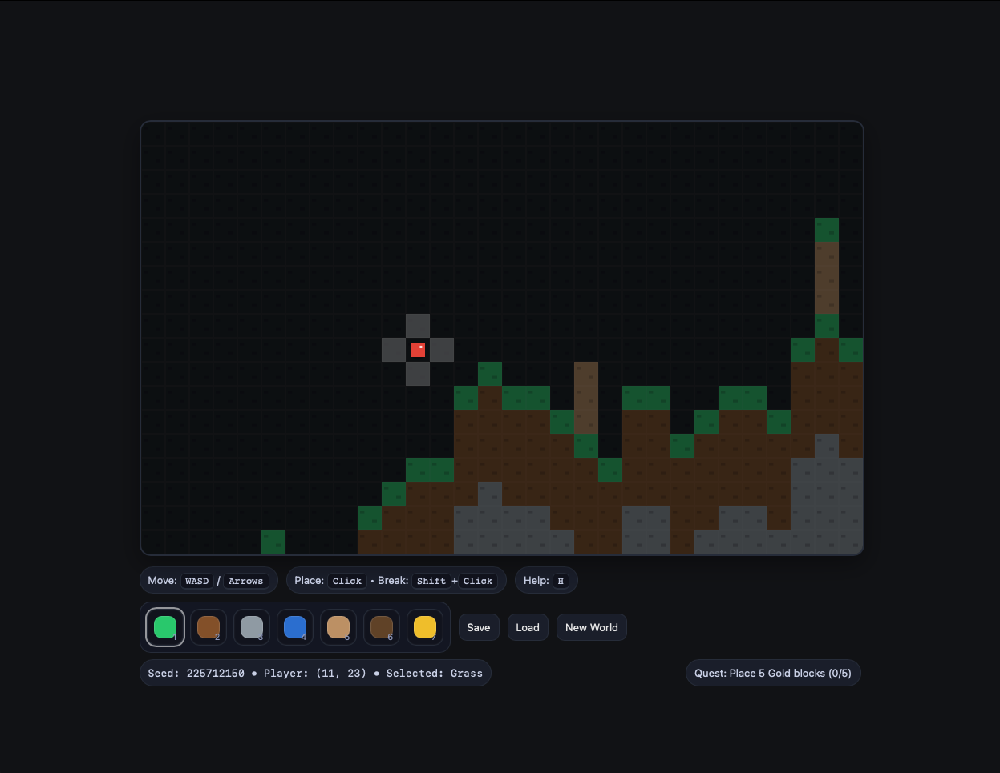

# MiniCraft JS  
### A Modular Coding Sandbox for Tweens (Ages 8–13)

MiniCraft JS is a lightweight browser-based sandbox game designed to teach **beginner programming concepts** through modifying a simple game engine.

Students can open the project in a browser and edit small JavaScript files to create **new blocks, quests, and gameplay behavior**.

Instead of building a game from scratch, learners interact with a **working game engine**, similar to how real game developers create mods.

The project was designed for:

- coding workshops  
- homeschool STEM lessons  
- library coding clubs  
- beginner programming classes  

---

# Screenshot



---

# Features

• Runs entirely in the browser  
• No installation required  
• Tile-based sandbox world  
• Modular game engine architecture  
• Dynamic quest system  
• Torch lighting that illuminates nearby blocks  
• Infinite building blocks for creative gameplay  
• Save/load system using browser storage  

---

# Educational Concepts

MiniCraft JS introduces several core programming ideas:

| Concept | How Students Learn It |
|------|------|
| Variables | Tracking player state and quest progress |
| Objects | Block definitions and properties |
| Arrays | Lists of blocks and quests |
| Loops | Counting blocks in the world |
| Conditionals | Quest completion logic |
| Modular design | Engine vs student files |
| Event hooks | Responding to world changes |

Students learn by **editing code and immediately seeing the results in the game**.

---

# Project Structure

The codebase is organized to clearly separate **engine code** from **student-modifiable content**.

```
MiniCraftLesson/
│
├─ index.html
│
├─ lib/                # Core game engine
│  ├─ 00_config.js
│  ├─ 01_utils.js
│  ├─ 02_blocks.js
│  ├─ 03_worldgen.js
│  ├─ 04_state.js
│  ├─ 05_input.js
│  ├─ 06_rules.js
│  ├─ 07_ui.js
│  ├─ 08_render.js
│  └─ 09_loop.js
│
└─ student/            # Files students modify
   ├─ student_blocks.js
   └─ student_quests.js
```

This structure mirrors how many real games separate:

```
Game Engine
+
Content Mods
=
Game
```

Students only need to edit the files inside **`student/`**.

---

# Getting Started

### 1. Clone the repository

```
git clone https://github.com/YOUR_USERNAME/minicraft-js.git
```

Or download the repository as a ZIP file.

---

### 2. Open the game

Simply open:

```
index.html
```

in any modern browser.

No server required.

---

# Controls

| Action | Key |
|------|------|
Move | WASD or Arrow Keys |
Place Block | Mouse Click |
Break Block | Shift + Click |
Select Block | Keys 1–8 |
Help Menu | H |

---

# Student Modding

Students modify the game by editing files in the `student` folder.

---

## Adding a New Block

Edit:

```
student/student_blocks.js
```

Example:

```javascript
MiniCraft.blocks.defs[7] = {
  name: "Gold",
  solid: true,
  color: "#f1c40f"
};

MiniCraft.blocks.hotbar.push(7);
```

Reload the page to see the new block.

---

## Creating a Quest

Edit:

```
student/student_quests.js
```

Example quest:

```javascript
function updateQuest() {

  const goldBlocks = countBlocks(7);

  if (goldBlocks >= 5) {
    MiniCraft.ui.setQuest("Quest Complete: Gold Builder!");
  }

}
```

Students can invent their own game challenges.

Examples:

- Build a tower  
- Place 10 torches  
- Build a bridge across water  
- Make a gold castle  

---

# Torch Lighting System

Torches act as light sources that illuminate nearby blocks.

Each torch block defines a **light radius**:

```javascript
lightRadius: 4
```

The renderer calculates brightness for nearby tiles using distance from the light source.

This introduces students to simple **game lighting mechanics**.

---

# Save System

The game automatically saves using browser storage.

Buttons in the UI allow:

- Save world  
- Load world  
- Generate new world  

Data is stored using:

```
localStorage
```

inside the browser.

---

# Lesson Plan (90 Minutes)

Suggested teaching structure.

### Part 1 – Run the Game (10 min)

Students explore the world and controls.

---

### Part 2 – Add a Block (20 min)

Students edit `student_blocks.js` to create a new block.

---

### Part 3 – Add a Quest (25 min)

Students write a simple quest in `student_quests.js`.

---

### Part 4 – Creative Modding (30 min)

Students invent their own blocks and quests.

Examples:

- Lava block  
- Crystal block  
- Build challenges  
- Exploration quests  

---

### Part 5 – Show and Tell (5 min)

Students present their mods.

---

# Why This Project Works Well for Beginners

Traditional programming lessons often feel abstract.

MiniCraft JS connects programming directly to **visible results**:

```
Write Code
↓
Reload Game
↓
See Changes Immediately
```

This feedback loop is extremely effective for beginner learning.

---

# Possible Future Extensions

This project is intentionally simple but can grow into more advanced lessons.

Potential upgrades include:

- crafting recipes  
- inventory system  
- cave generation  
- ore generation  
- day/night cycle  
- enemies and survival mechanics  
- multiplayer support  
- student-created mod packs  

---

# Contributing

Pull requests and improvements are welcome.

Ideas for contributions:

- new blocks  
- new quests  
- improved lighting  
- educational lesson material  

---

# License

Open source for educational use.

You are free to use, modify, and adapt this project for teaching.

---

# Inspiration

MiniCraft JS is inspired by sandbox games like:

- Minecraft  
- Terraria  
- Factorio  

but simplified to make the underlying code approachable for beginner programmers.